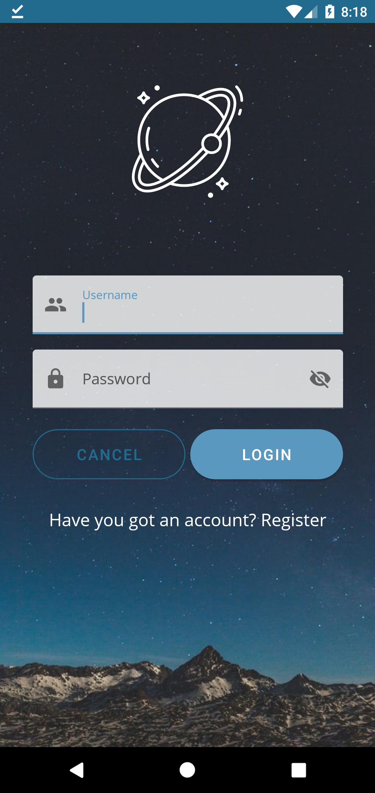

# MyNiceStart

[Santiago Torres en github](https://github.com/santiagoTorres27)

CFGS Desarrollo de Aplicaciones Multiplataforma

Desarrollo de Interfaces

## Lista de Activities
1. **Splash Activity**
    Pantalla de bienvenida a la aplicación. Tiene animaciones tanto en el logo como en el slogan
2. **Login**
    Pantalla de Login, en la parte superior se encuentra el logo seguido de los campos en los cuales el usuario puede ingresar su nombre y su contraseña. El botón de login dirige hacia el MainActivity mientras que el TextView inferior dirige hacia la pantalla de SignUp
3. **SignUp:** En este Activity el usuario podrá registrarse ingresando su nombre, email y contraseña.
5. **MainActivity:**
   Este Activity Tiene un ImageView con una foto de perfil de un usuario además de un ButtonStraight que redirecciona a su activity hijo (MainActivity2).
   Tiene varios componentes como son: Menu contextual, AppBarMenu, BottomNavigationView, SwipeRefreshLayout con SnackBar, Alert/DialogModal y un Expandable CardView.
5. **MainActivity2:** Ventana hija de MainActivity, consta de un ImageView con una imagen de ejemplo.

## Vista de los Activities en vista vertical
Splash | Login | Sign Up
------ | ----- | ------
 |  | 

MainActivity| ContextMenu | SwipeRefreshLayout
---|---|---|
||

ModalDialog| ExpandableCardView | MainActivity2
---|---|---|
||

## Vista de los Activities en vista horizontal
Splash | Login
-------|------
|

SignUp | MainActivity | MainActivity2
-------|------|--------
||
